# LLS-LOAM
Lidar Odometry and Mapping with Mutiple Metrics Linear Least Square ICP

## How to use

1. Install dependent 3rd libraries: 
PCL, OpenCV, Eigen, VTK, Glog, Gflags.

If you'd like to use your own data and want to know its absolute projected coordinate, install Proj.

2. Compile
```
mkdir build
cd build
cmake ..
make 
```

3. Run
```
cd ..
# If you'd like to test on kitti dataset
# See below for data preparation
sh script/kitti/kitti_xx.sh
# If you'd like to test on your own dataset, you need to create new shell files and then run it
```

## How to prepare the data
For kitti dataset, you may refer to https://github.com/YuePanEdward/Pointcloud_Format_Transformer.

After transforming the point cloud from .bin to .pcd, rename the point cloud folder HDL64.

Horizontally, create a folder called OXTS, and put the ground truth pose .txt file (which can be download from kitti's website) into it.

Then create a pcd file list:
```
touch file_list.txt
ls HDL64 >> file_list.txt
```

Then the data is ready for test.

For your own dataset, if the point cloud are in pcd format and the pose and imu information are in oxts format, then you can directly use this programme (LoadPcImuGnss Method). Or you need to transform the data youself.

## TO DO LIST

0.For the loop closure and pose graph optimization module, the code is not released.

The walkaround is here: https://github.com/YuePanEdward/CloudControlNet

1.Speed up

2.Solve the serious Z drift problem

3.Add ROS module

## Demo

### On KITTI dataset

#### Yellow: Lidar Odometry Position, Purple: Ground Truth Position

#### seq 00
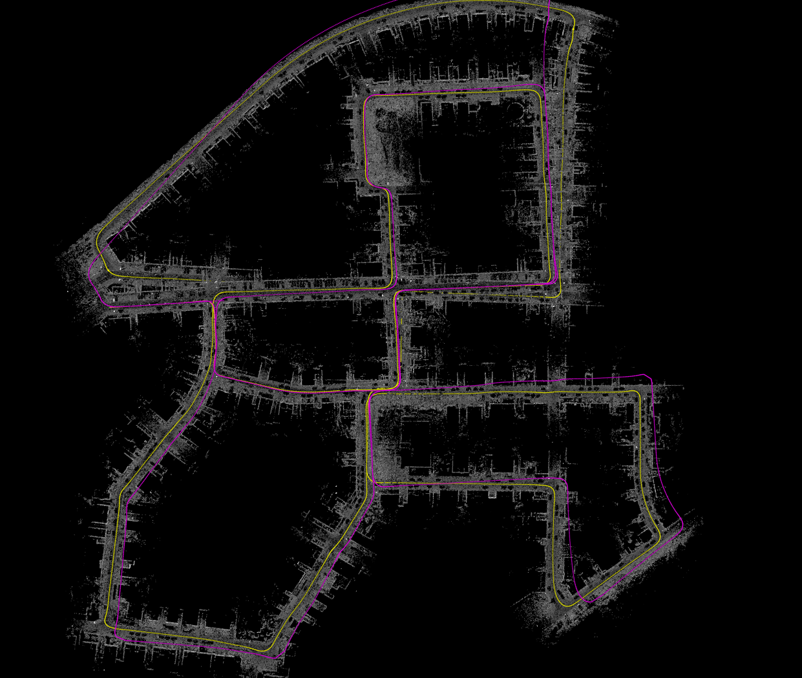

#### seq 01
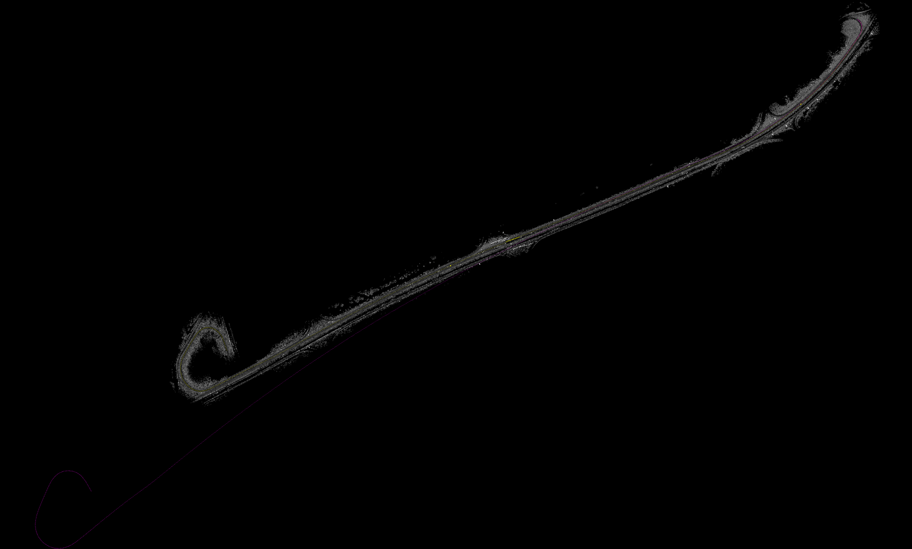

#### seq 02
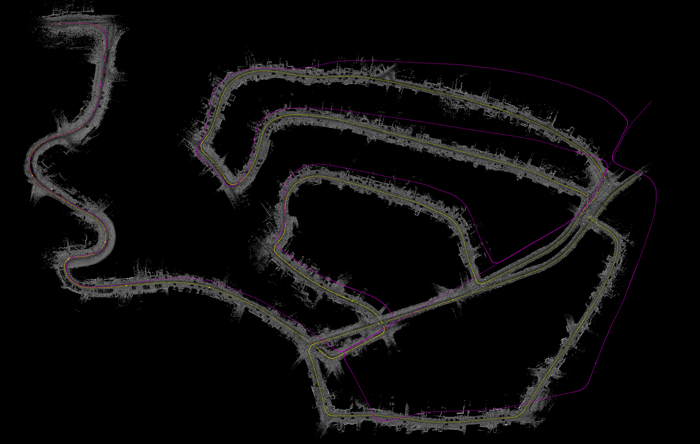

#### seq 03
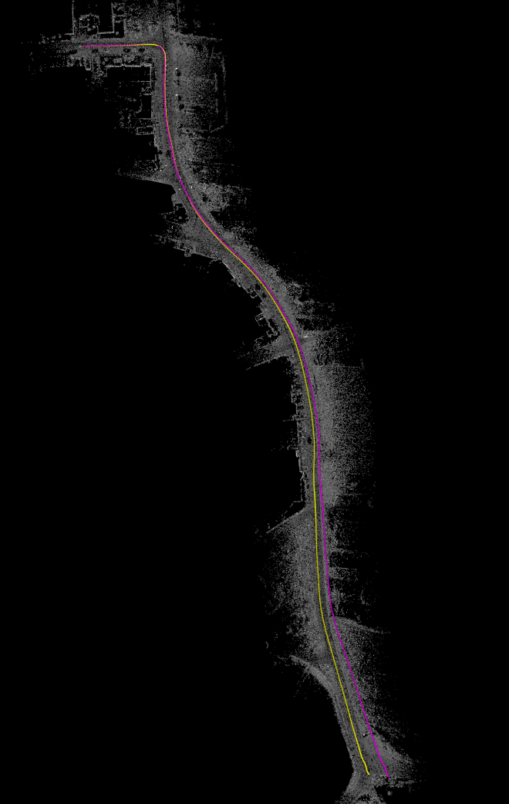

#### seq 04
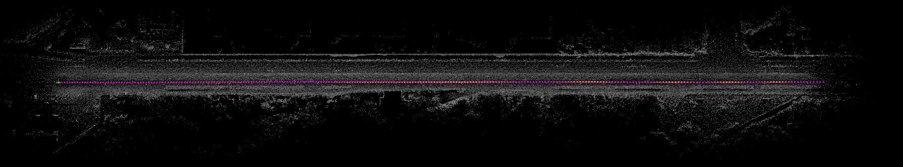

#### seq 05
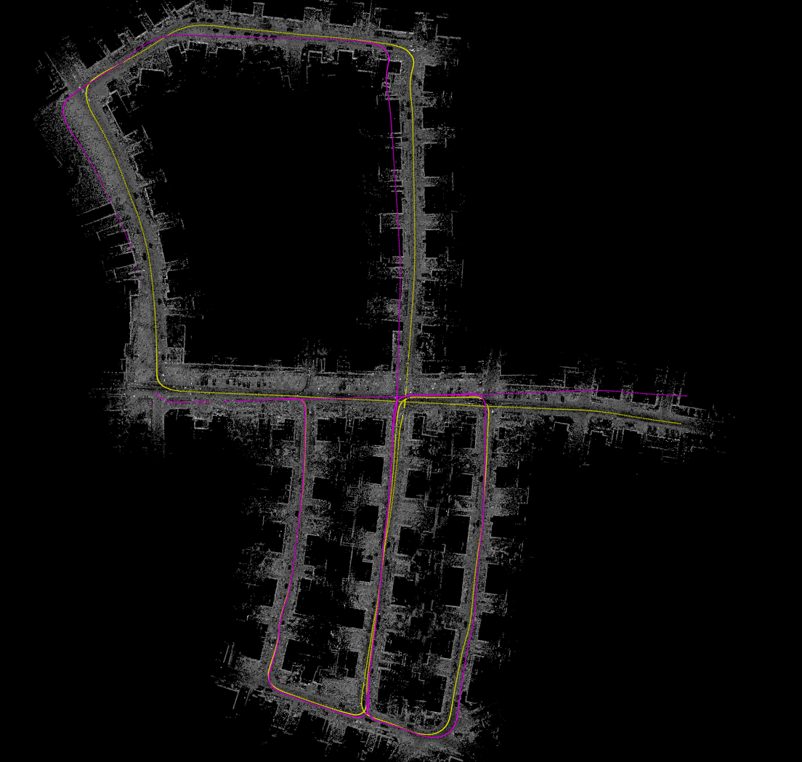

#### seq 06
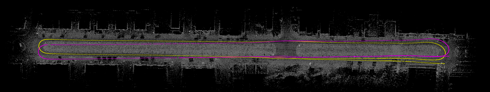

#### seq 07
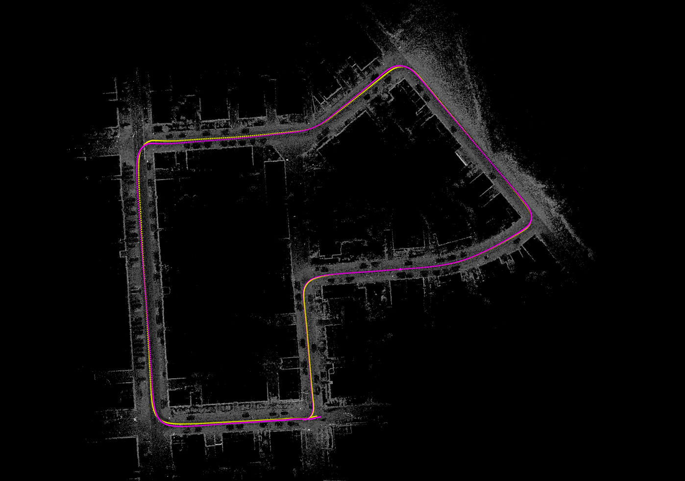

#### seq 08
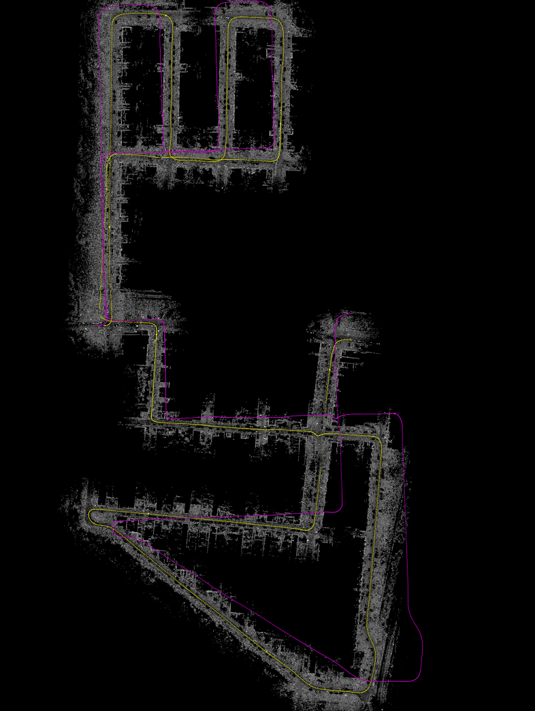

#### seq 09
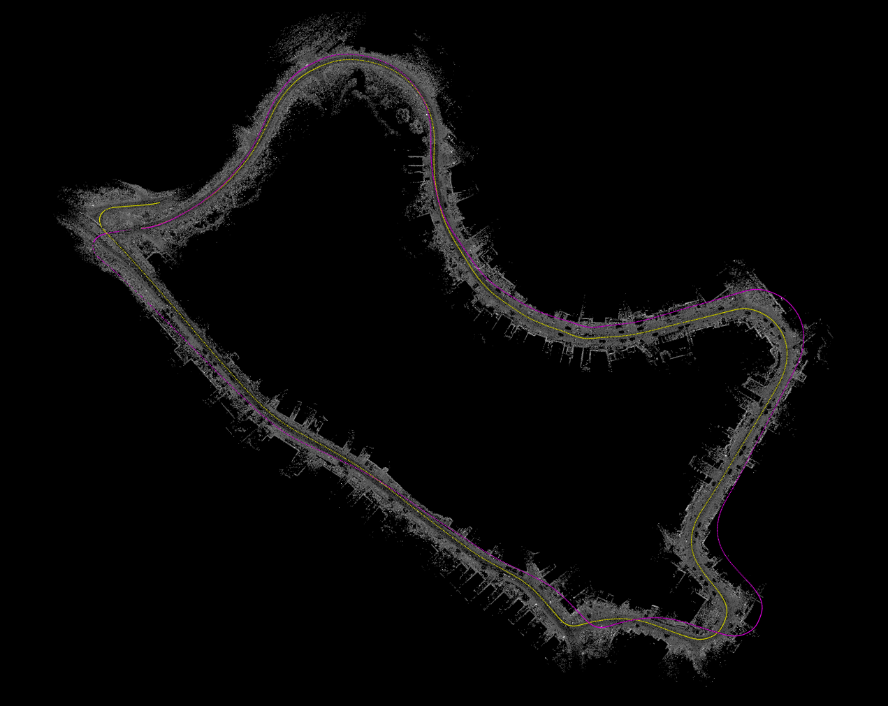

#### seq 10
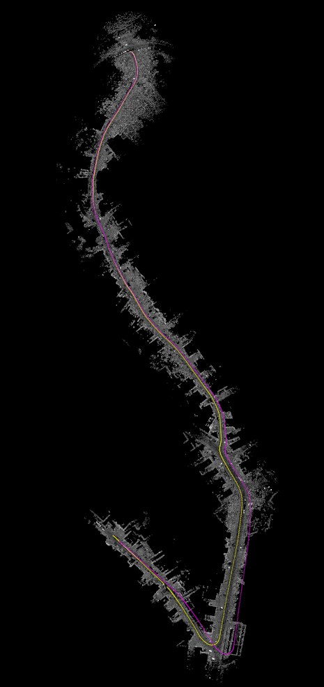

#### Quantity Evaluation on KITTI dataset

| seq | ATE(%) | ARE(0.01deg/m) | TPF(ms/frame) |
|-----|-----|-----|-----|
| 00  | 1.362     | 0.603    | 193.4    |
| 01  | 4.175     | 1.076    | 183.8    |
| 02  | 2.210     | 0.928    | 196.8    |
| 03  | 1.282     | 1.037    | 181.5    |
| 04  | 2.108     | 0.981    | 194.3    |
| 05  | 1.453     | 0.677    | 189.3    |
| 06  | 1.119     | 0.609    | 188.6    |
| 07  | 0.763     | 0.505    | 198.1    |
| 08  | 1.834     | 0.800    | 187.4    |
| 09  | 2.293     | 1.008    | 191.2    |
| 10  | 2.692     | 0.905    | 190.4    |

### On own dataset

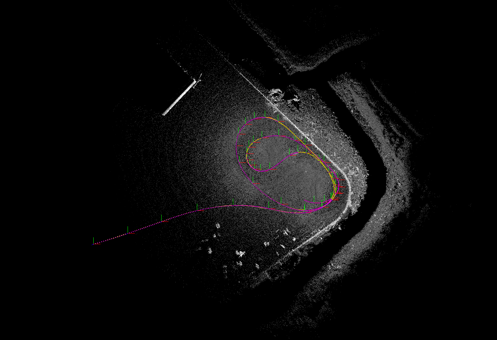

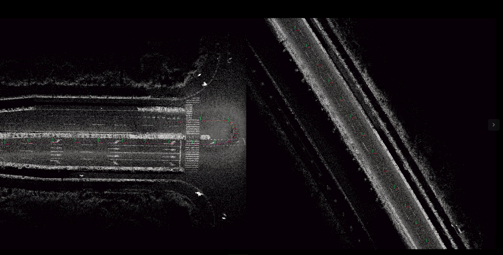